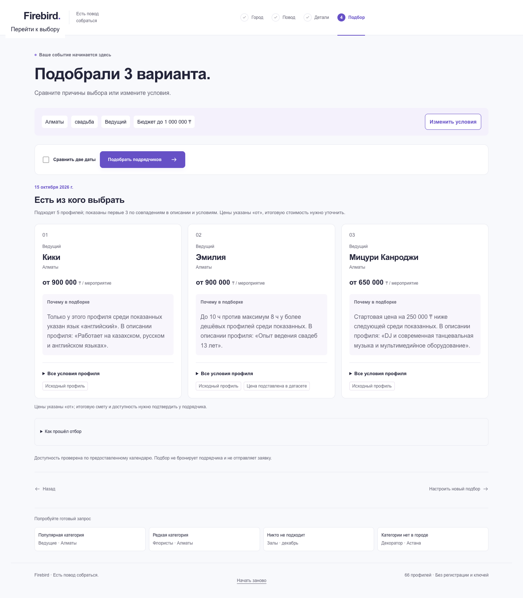

# Firebird — умный подбор подрядчиков

Решение кейса **#79-lite · HackAlem AI** для выбора event-подрядчиков в Казахстане.

Firebird помогает организатору мероприятия выбрать до трёх подрядчиков под дату, город и бюджет. Для каждого варианта сервис показывает конкретные причины выбора и отличия от остальных. Если подходящих вариантов мало или нет, объясняет причину и предлагает возможное изменение условий.



*Результат сценария «Популярная категория» на предоставленном каталоге.*

## Что можно проверить

- **Обоснованный выбор:** до трёх карточек с ценой, совпавшими условиями и индивидуальным объяснением на основе фактов профиля.
- **Учёт занятости:** занятые на выбранную дату подрядчики исключаются. Сравнение двух дат показывает, кто исчез из выдачи из-за занятости.
- **Понятный результат при любых условиях:** сервис различает успешный подбор, отсутствие категории в городе и отсутствие подходящих по условиям. Если вариантов меньше трёх, объясняет почему.
- **Помощь с изменением запроса:** кнопки позволяют проверить ближайшую подходящую дату или минимальный новый бюджет, сохраняя остальные условия. При отсутствии категории можно проверить другой город.
- **Повторяемость:** одинаковый запрос возвращает тот же порядок карточек и тот же текст.

## Быстрый запуск

Нужны **Git, Node.js 22.12+ и npm**. Проверено на macOS с Node.js 22.22.2 и npm 10.9.7. Для клонирования нужен доступ к командному репозиторию.

```bash
git clone https://github.com/BAITC-Hacks/hack-a9079fb6-team.git
cd hack-a9079fb6-team
npm ci
npm run dev
```

Откройте [http://127.0.0.1:3000](http://127.0.0.1:3000) и нажмите **«Популярная категория»**.

**Настройка окружения не требуется:** данные включены в репозиторий, переменные окружения, API-ключи, база данных и аккаунты для приложения не нужны. Интернет требуется для установки зависимостей; подбор работает локально.

Если порт занят, выполните `npm run dev -- --port 3001` и откройте [http://127.0.0.1:3001](http://127.0.0.1:3001).

Для запуска production-сборки остановите dev-сервер и выполните из корня проекта:

```bash
npm run build
npm start
```

## Проверка за три минуты

Демо-кнопки заполняют параметры и выполняют подбор. Ожидаемые результаты относятся к исходному каталогу из 66 профилей.

| Действие | Ожидаемый результат |
| --- | --- |
| Нажмите **«Популярная категория»**: ведущий, Алматы, свадьба, 15.10.2026, 1 000 000 ₸ | Пять подрядчиков проходят условия; показаны три с разными объяснениями. Сравните их отличительные факты и цитаты. |
| Повторите запрос кнопкой **«Подобрать подрядчиков»** | Порядок карточек и объяснения сохраняются. |
| Включите **«Сравнить две даты»**, задайте 19.12.2026 и нажмите **«Сравнить даты»** | На первой дате — три карточки, на второй — одна. Интерфейс объясняет исключение двух подрядчиков занятостью на второй дате. |
| Нажмите **«Редкая категория»**: флорист, Алматы, свадьба, 15.10.2026, 300 000 ₸ | Две карточки и объяснение, почему третьей нет. |
| Нажмите **«Никто не подходит»**: банкетный зал, Алматы, той, 26.12.2026, 1 000 000 ₸ | Карточек нет: шесть залов заняты, один дороже бюджета. Есть объяснение и предложение увеличить бюджет. |
| Нажмите **«Категории нет в городе»**: Астана, декоратор, свадьба, 15.10.2026, 2 000 000 ₸ | Отдельное сообщение: в этом городе нет подрядчиков выбранной категории. Кнопка другого города запускает проверку с прежними остальными условиями. |
| В пустом результате нажмите предложенную кнопку бюджета или даты | Указанное условие меняется, выполняется новый подбор. Подсказка не меняет условия автоматически. |

Цена и отличие подрядчика видны сразу; совпавшие условия раскрываются по ссылке **«Все условия профиля»** на карточке. Пошаговый помощник доступен при заполнении формы, расположен после неё на мобильном экране и скрыт на экране результатов.

## Как работает решение

```text
Параметры мероприятия
  → проверка запроса
  → фильтрация каталога по условиям и занятости
  → детерминированное ранжирование и выбор до трёх вариантов
  → индивидуальные объяснения, причины отсева и подсказки
```

**Архитектура:** веб-интерфейс и API работают в одном приложении Next.js. Сервер загружает локальный CSV при запуске; запросы используют каталог в памяти. После изменения данных требуется перезапуск.

**Стек:** Next.js, React и TypeScript — интерфейс и сервер; csv-parse — чтение данных; Zod — проверка входных параметров; Vitest и Playwright — автоматические проверки. Версии зависимостей зафиксированы в `package-lock.json`.

Обязательные параметры — город, дата, формат мероприятия, категория и бюджет. Дополнительно можно указать длительность, язык и пожелание. Сначала исключаются профили, не проходящие условия. Оставшиеся ранжируются по совпадению слов описания с форматом и пожеланием, затем по запасу бюджета, языку, доступным часам и идентификатору.

Для пожеланий используется лексическая эвристика с нормализацией «е/ё» и распознаванием некоторых отрицательных конструкций. Она снижает риск повышения профиля за фразу, которая прямо отрицает пожелание, но не обеспечивает полного понимания смысла, сложных формулировок или иронии.

Объяснение выделяет фактическое отличие от других показанных вариантов, когда оно есть. Содержательная цитата из описания дополняет объяснение; если такой цитаты нет, остаются проверяемые условия. **Объяснения формируются из фактов каталога по шаблонам; LLM в продукте не используется.** AI-инструменты применялись при разработке кода и тестов.

## Проверка качества

Автоматические проверки охватывают фильтры, занятость, повторяемость, различимость объяснений, точность цитат, пустые результаты и API. Браузерные сценарии проверяют демо, сравнение дат и мобильный экран.

```bash
npm test
npm run test:coverage
npm run typecheck
npx playwright install chromium
npm run test:e2e
```

E2E запускают свой сервер на порту 3100. На Linux для установки браузера с системными зависимостями используйте `npx playwright install --with-deps chromium`. Для обычного запуска приложения Playwright не нужен.

**357 тестов, 11 браузерных сценариев и 99,37% покрытия строк ядра/API** прошли на текущем исправлении. Результаты и условия проверки приведены в [отчёте проверки — раздел «Исправления better-interface»](docs/verification.md). Ориентир ТЗ для ответа — до 10 секунд; локальные измерения не являются гарантией времени под нагрузкой.

## Данные и границы MVP

- Используется предоставленный организатором анонимизированный каталог: **66 профилей, включая 13 синтетических**. Метки синтетических профилей и подставленных городов/цен видны на карточках. Условия использования исходных данных определяет предоставившая сторона.
- Календарь охватывает **23.09.2026–31.12.2026**. Даты вне этого окна не позволяют проверить доступность. Отсутствие отметки занятости в каталоге требует подтверждения у подрядчика.
- Цена указана **«от»**; итоговую стоимость нужно согласовать. Цитаты передают описание автора профиля. Число выполненных условий не является оценкой качества подрядчика.
- MVP помогает выбрать кандидатов; бронирование, связь с подрядчиками и обновление реальных календарей в него не входят.

Дальнейшее развитие: подключение актуальных календарей, подтверждение фактов профилей и оценка ранжирования на размеченных заказах. Семантический поиск можно добавить с сохранением строгих фильтров и воспроизводимости.

## Документация

- [Задание Firebird и критерии оценки](docs/task.md)
- [API: запросы, ответы и обработка ошибок](docs/contract.md)
- [Результаты проверок и условия измерений](docs/verification.md)
- [Демо-сценарий](docs/demo.md)
- [Дополнительные эксперименты производительности](benchmarks/README.md)

Сторонние open-source компоненты перечислены в разделе стека; их лицензии доступны в установленных пакетах. Основная функциональность проекта разработана в рамках хакатона.
